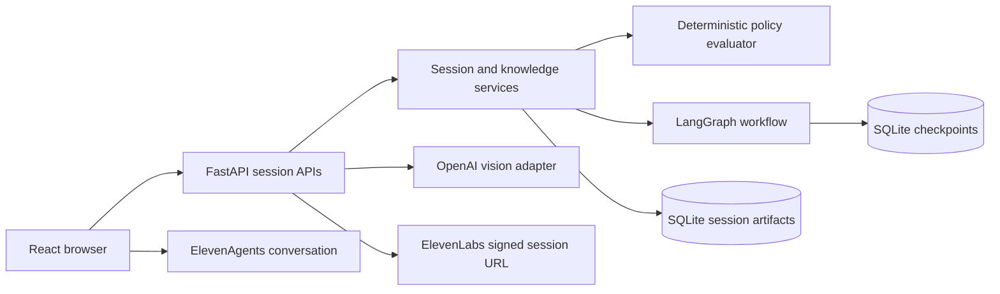

# Architecture

## Runtime boundaries

React and TypeScript own browser permissions, screen selection, resizing/masking, microphone interaction, speech/activity signals, and rendering. FastAPI owns session state, validated provider inputs, workflow progression, confirmation, policy evaluation, and assessments. Neither screen text nor an LLM output can execute a policy or bypass the decision save gate.



Python modules are divided by purpose: `contracts.py` defines Pydantic boundaries; `seed.py` defines synthetic cases and controlled scripts; `policies.py` performs pure evaluation; `services.py` applies session and knowledge changes; `workflow.py` persists transitions and the confirmation pause; `storage.py` stores validated session documents through SQLAlchemy; `integrations.py` isolates provider SDK calls; `main.py` exposes HTTP and WebSocket boundaries.

## Workflow and persistence

The explicit workflow is:

**Capture → Debrief → Awaiting confirmation → Approved map → Training → Results**

A LangGraph thread is keyed by session ID. Its checkpointed state contains the phase, required gaps, and map version. Capture, debrief, and training pause at meaningful boundaries. Confirmation uses a LangGraph interrupt and can resume only after the service checks explicit expert confirmation, the current map version, resolved gaps, and stored evidence IDs. Frames and audio packets do not enter the graph.

SQLite stores one validated session document containing cases, events, a versioned Work Map, challenge approvals, and learner attempts. This small local prototype deliberately avoids a vector database or a distributed job queue. Writes are guarded in the API process. It is designed for one local backend worker; it is not a distributed, multi-user persistence design.

Corrections first produce reviewed field proposals. Applying one to an approved map preserves an immutable approved snapshot, increments the draft version, and resets confirmations. Teach-back and explicit confirmation are required again. Existing challenges, attempts, and their training pin are preserved. Selecting an approved training version is explicit; challenge evidence and tutor retrieval resolve that version.

## Events and evidence

Every stored event has:

```json
{
  "event_id": "uuid",
  "session_id": "uuid",
  "event_type": "expert_answer",
  "timestamp": "UTC ISO 8601",
  "source": "expert",
  "payload": {"condition": "coverage", "text": "Expert-entered text"}
}
```

Sources distinguish authoritative `sandbox` data, expert-entered evidence, `simulated` events, `visual` observations, learner answers, and system transitions. Rule steps include actual screen/sandbox event IDs and timestamps, decision, guardrails, exceptions, escalation owner, and confirmation metadata. Rule quotations come from actual stored answer/correction events. Scripted answers retain their simulated source. Evidence links resolve through the session-scoped evidence endpoint; a missing or deleted artifact returns 404.

A visual model observation is a validated description of what is visible. It cannot become authoritative application data or expert intent. The model receives an instruction to treat screen content as untrusted data and report uncertainty. Candidate knowledge is observed until confirmed. An unresolved condition cannot be presented by the tutor as a confirmed rule.

## Deterministic approval and training

The evaluator uses explicit Python checks for version match, coverage of changed functionality, independent review, required information, and passing test results. It never executes generated expressions or code. Sandbox baseline policies are fictional and always enforce the review portal’s approval gate. Captured expert explanations are separate knowledge artifacts. Confirmation validates that each captured rule uses a supported type and resolves to stored evidence before allowing that typed rule to support training. The rule's title/type determines its executable check; free-form expert wording never rewrites the baseline evaluator. Live correction extraction proposes schema-validated fields; credential-free extraction uses controlled examples or explicit structured editing. Removing existing required scope is rejected. Ambiguous/unsupported proposals remain inactive, and expert review must still catch semantic mistakes.

When saving a sandbox decision, the server loads and evaluates the current persisted case. “Ready for approval” is blocked with structured violations when any required check fails. Hold and Escalate remain available. No expert evidence ID is invented to decorate a baseline violation.

Seeded challenge templates select confirmed supported rules and their additional scope/failure action, vary functionality and versions, and check that exactly the intended violation remains. Provenance includes source rule/evidence/version, template, and seed. Hold and Escalate are accepted safe alternatives on failing cases. The expert must approve them. The first learner decision and explanation are stored before a hint can be requested. A small, visible English concept rubric checks the policy concepts exercised by the case; it does not use an LLM or claim general language understanding. Unsafe approval is recorded as an attempt but is not saved to the case. Later corrections and hint use are reported separately from independent success. The independent assessment disables hints. The MVP does not use model-generated grading or mastery percentages.

## Capture, voice, and recording controls

Browser-selected frames are resized and user-configured mask regions are applied before sending them. The browser skips work while a previous upload is active; the backend also permits only one in-flight frame per session and two total in-flight vision calls, returning 429 instead of queueing more work. This bounds work instead of accumulating a frame queue.

Consent and off-record state are checked both before starting frame processing and before storing a provider result. Turning off record cannot retract an already transmitted request. The browser ends the voice conversation and shared tracks for off-record/deletion. Muting the microphone has a narrower scope than ending a session.

Private ElevenLabs agents use a backend-issued signed URL and a browser WebSocket conversation. Permanent keys stay on the backend. Transcript callbacks provide speech evidence; a separate Scribe stream is not required. Screen/map summaries are sent as contextual updates. The read-only context API validates session ID, voice role, and optional case/challenge IDs; tutor access additionally requires approved supported knowledge. The browser client tool validates its active session and optional case/challenge IDs, inserts the actual voice role, and calls the validated backend endpoint before returning bounded session context. The agent cannot approve maps or save decisions through this tool.

In simulated mode, demo audio requires an explicit enable action. A shared browser speech module handles loaded/default voices, single playback, replay, stop, mute, and errors; its speaking state gates timing. A bounded queue schedules questions automatically after Start capture. Live question cues and bounded screen/map context are forwarded through the ElevenLabs conversation. Question timing combines in-app interaction, speech activity when available, frame stability, and a cooldown. Explicit Ask now, Let me finish, and Pause controls remain authoritative user controls. Silence alone is not evidence that the reviewer has stopped reading. The timing heuristic is local to this app and cannot observe typing in arbitrary external applications.

## API surface

| Area | Routes |
| --- | --- |
| Liveness / readiness | `GET /health`, `GET /ready` |
| Sessions | `GET/POST /api/sessions`, `GET/DELETE /api/sessions/{id}` |
| Recording / questions | `POST .../recording`, `POST .../questions`, `POST .../answers` |
| Debrief / map | `POST .../debrief`, `POST .../gaps`, `GET .../map`, `POST .../map/correct` (legacy wording-only), `POST .../map/corrections/propose`, `POST .../map/corrections/{id}/apply`, `POST .../map/teach-back`, `POST .../map/confirm` |
| Evidence / cases | `GET .../evidence/{event_id}`, `GET .../cases/{case_id}`, `POST .../cases/{case_id}/observe`, `POST .../cases/{case_id}/validate`, `POST .../cases/{case_id}/decision` |
| Challenges | `POST .../challenges/{id}/approve`, `POST .../challenges/{id}/answer`, `POST .../challenges/{id}/hint`, `POST .../results` |
| Capture / voice | `POST .../frames`, `POST .../voice/{role}`, `POST .../transcript`, `POST .../tools/context` |
| Event updates | `WS /api/sessions/{id}/events` |

Routes validate session context and Pydantic arguments. Unknown evidence/case/session IDs are rejected. Loopback host/origin checks and explicit CORS reduce accidental exposure, but they are not authentication. No network deployment is supported until identity and ownership authorization are implemented.

Request diagnostics are JSON records containing only method, path, status, and elapsed milliseconds. Bodies, headers, credentials, frames, and provider responses are excluded; SQLAlchemy also hides statement parameters.
